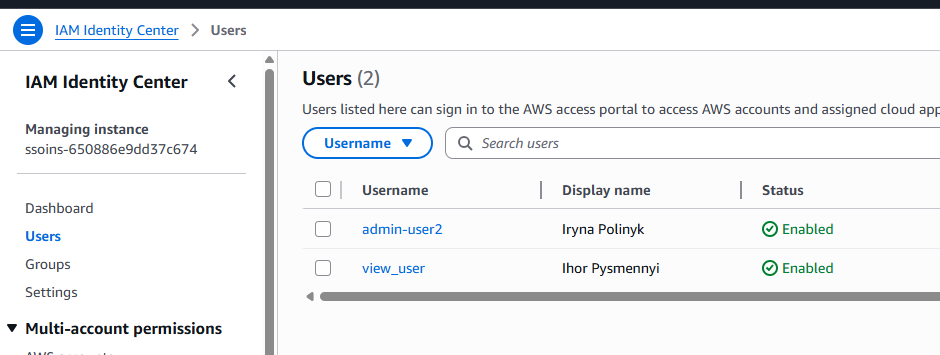
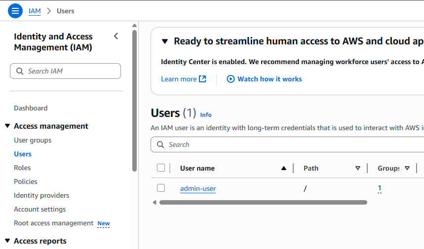

Set-up account. Register in a cloud provider. Now you have a root account. (1 point) Now perform one of the following (you need to select only one action):
Create an IaM user and attach FullAdmin policy. Use it for all future interactions with the system. (1 point) 
Create an IaM Identity center account (or analog for you cloud provider). Also make it full admin. (2 points) 
 
